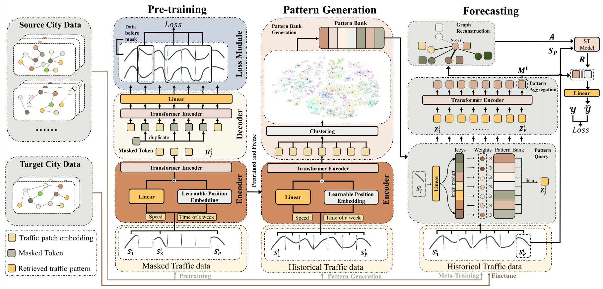

# Cross-city Few-shot Traffic Forecasting via Traffic Pattern Bank

In this repository, we presents the code of "Cross-city Few-shot Traffic Forecasting via Traffic Pattern Bank" (TPB).



## Environment
The code is implemented in pytorch 1.10.0, CUDA version 11.3, python 3.7.0.

```bash
pip install torch==1.10.0+cu113 -f https://download.pytorch.org/whl/torch_stable.html
```

## Reproducibility
The default configs of the four datasets are set in `./config`.
To reproduce the result, please run following command:
```bash
bash train.sh
```
or run the experiment on specific dataset (PEMS-BAY as an example):
```bash
CUDA_VISIBLE_DEVICES=0 nohup python -u train.py  --config_file ./configs/config_pems.yaml > train_pems.out 2>&1 &
```

The logs of the experiment are also contained in this repository:
```
vim ./train_pems.out
vim ./train_metr.out
vim ./train_chengdu.out
vim ./train_shenzhen.out
```

## Pre-trained stuff

The pre-trained patch encoder and traffic pattern bank is contained in this repository.
The pre-trained patch encoder is in `./save/pretrain_model` and the traffic pattern bank is in `./pattern`.

You can also pre-train and generate traffic pattern bank on your own by:
```bash
# Pre-train
python -u ./pretrain.py --test_dataset ${test_dataset} --data_list ${data_list}
wait
python -u ./patch_devide.py --test_dataset ${test_dataset} --data_list ${data_list}
wait
python -u ./pattern_clustering.py --data_list $data_list --test_dataset ${test_dataset} --sim ${sim} --K ${K}
```
`${data_list}` is the source data. For example, if you want to pre-train the encoder in `Chengdu`, `METR-LA` and `PEMS-BAY`, then `${data_list}` is `chengdu_metr_pems`.

`${test_dataset}` is the dataset you want to build target data on. If you want to build target data on `Shenzhen` then the `${test_dataset}` is `shenzhen`.

`${sim}` and `${K}` are the clustering hyper-parameter. You can set them by your own.